# Sugar Cosmetics Clone
Got an individual project to clone Sugar Cosmetics website. Sugar Cosmetics is an Indian e-commerce company focuses on selling makeup and skincare products that are millennial friendly, best suited for Indian skin tones and are cruelty-free.
---

### [click here to run live demo](https://drive.google.com/file/d/1Zmh7AV5NfaU7_mza35UMXcX4cL-snwJy/view?usp=sharing)

## Tech stacks used :
* **HTML**
* **CSS**
* **JAVASCRIPT**

***
## Landing Page :
- The Landing Page of Sugar Cosmetic website displays various products, offers and ads of their own.
- In top section there is a Header which displays Dropdown menu of pages.
- At the bottom section there is a footer, both Header & Footer are same across all the pages.

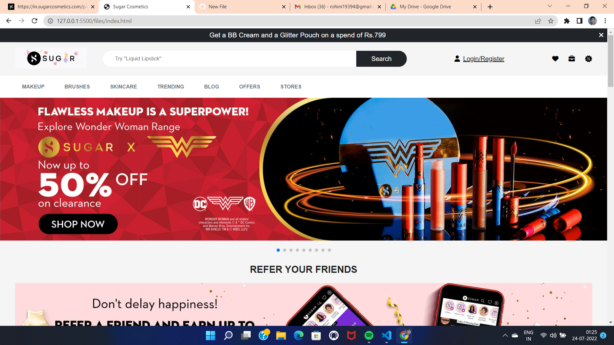

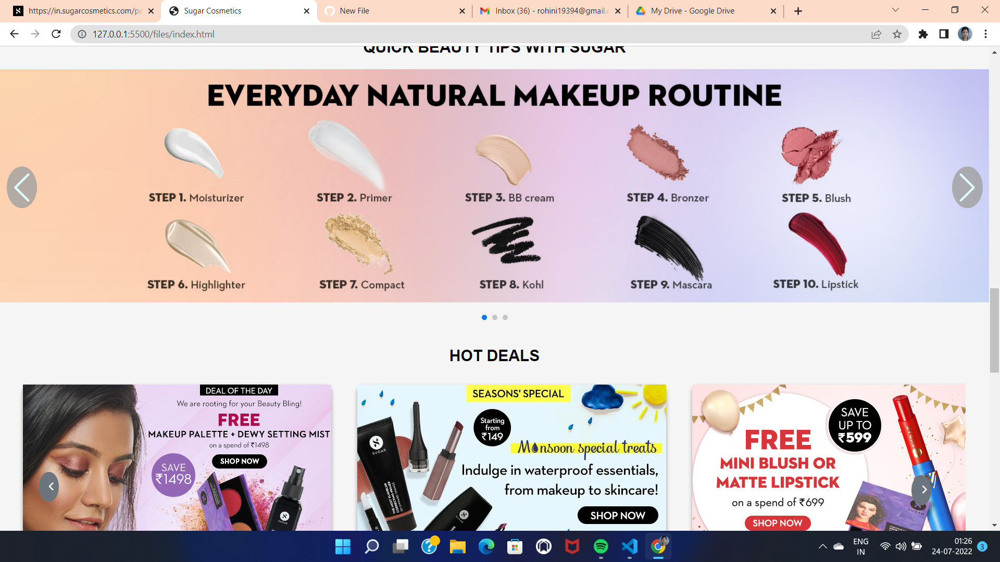

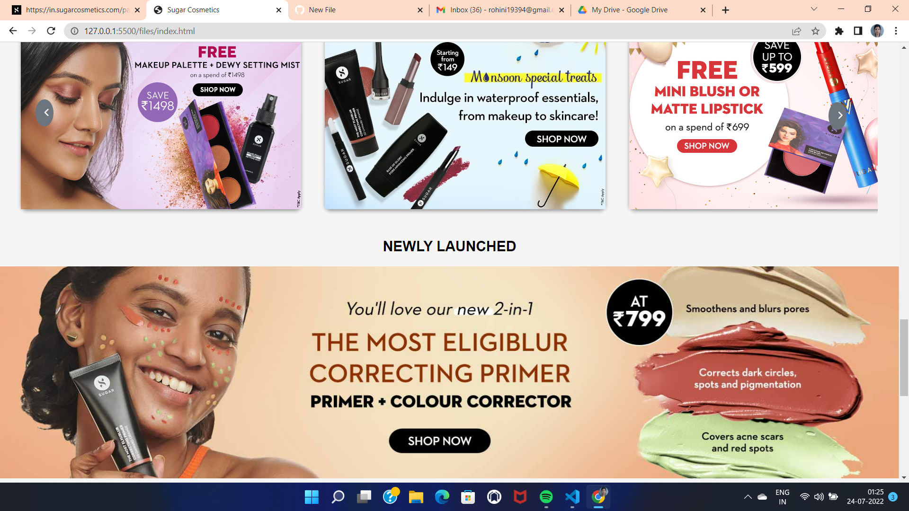

## Login page :
- User can login from sideBar of landing page.

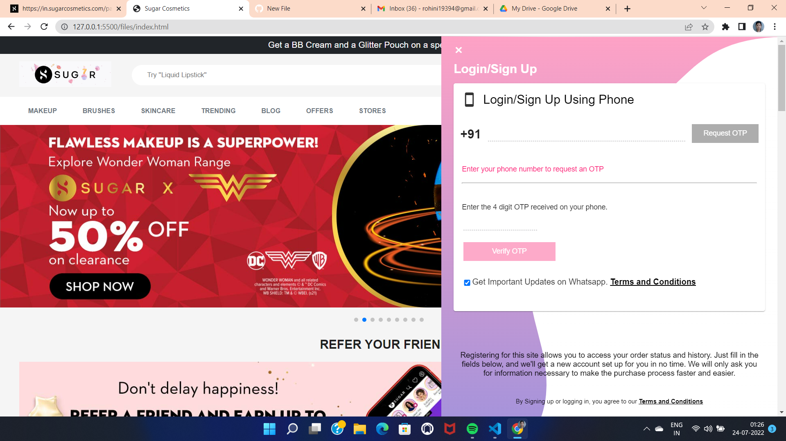

## Products Page :
- Clicking on dropdown content or searching using search , user will redirect to products page.
- Used filters and sort functionailty.

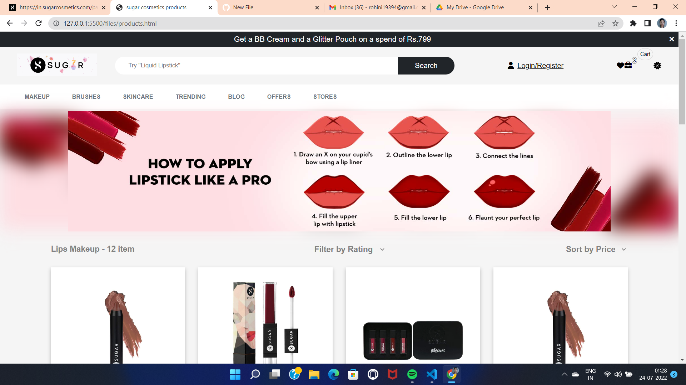

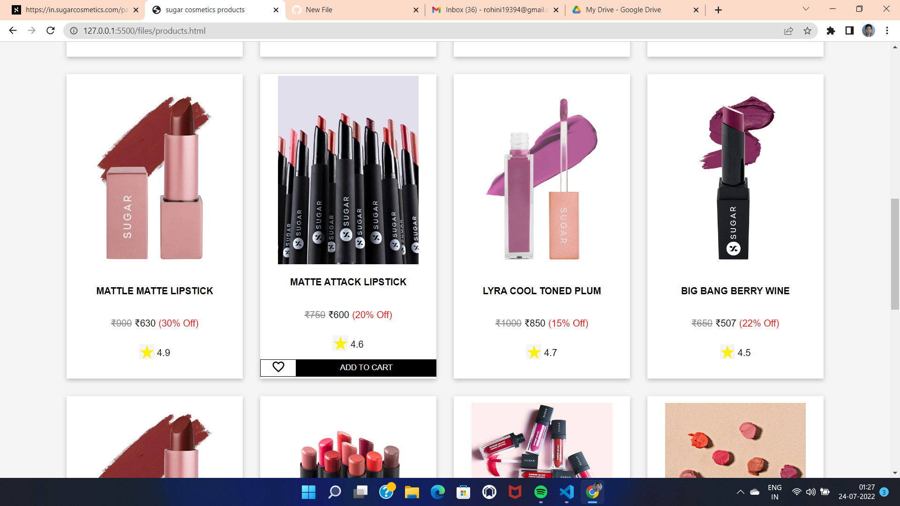

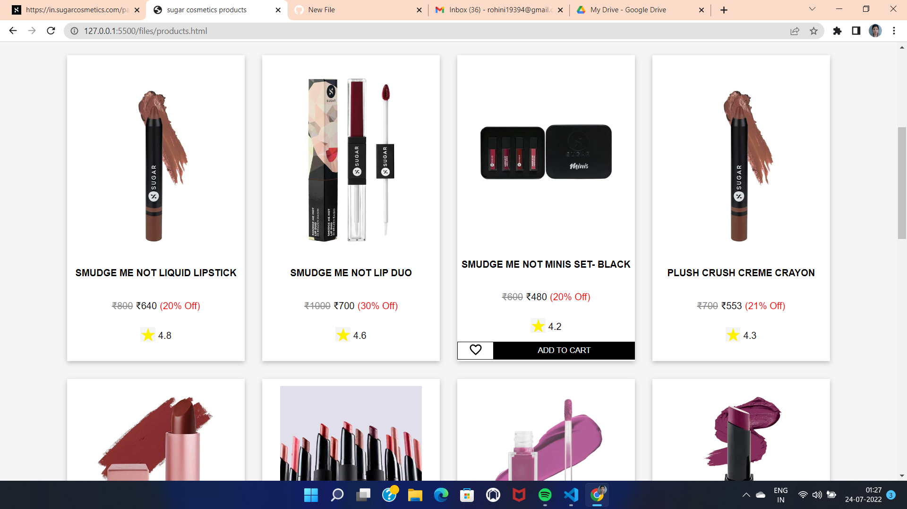

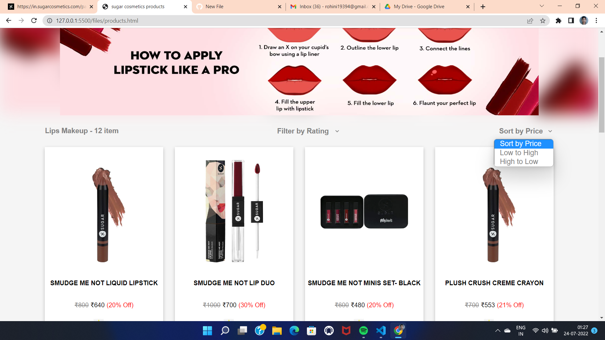

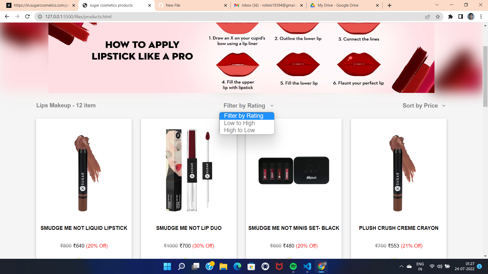

## Cart Page :
- By clicking on Add to cart button items added to cart and cart numbers on navbar will increse as the product added increases. 
- By clicking on cart icon user will be redirected to cart page.
- Here user can delete and increase the quatity of product.
- According to quatity, price also vary.

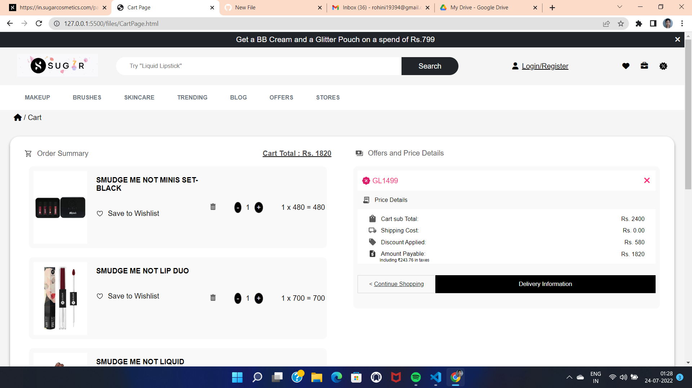

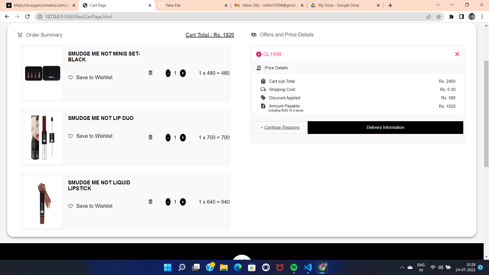

## Address Page :
- By filling all the details and clicking on proceed to payment, user will redirect to Payment page.

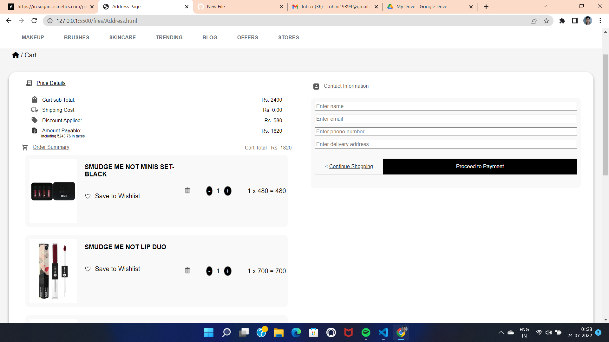

## Payment Page :
- There are various payment option shown.
- By clicking on any one of them, user can pay.

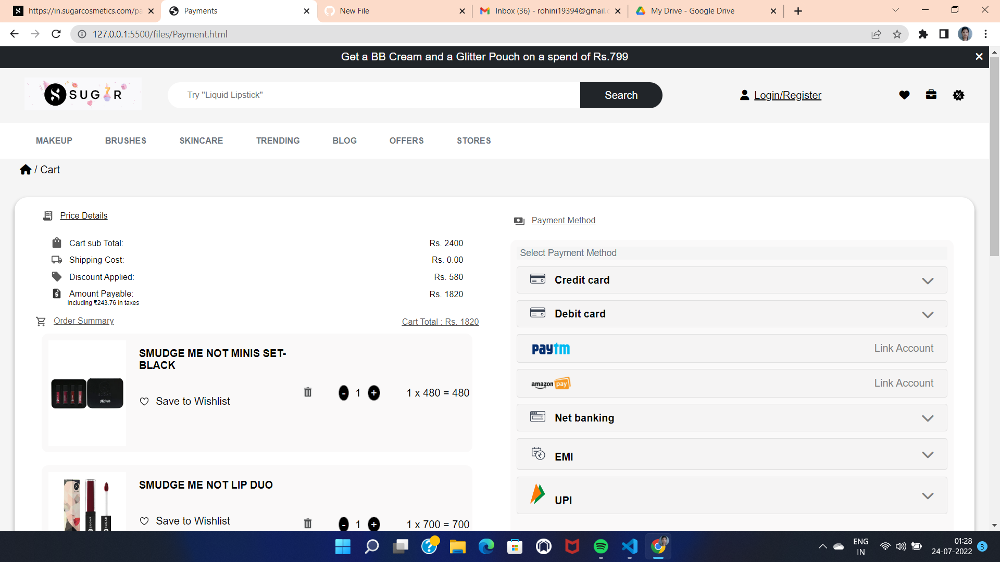

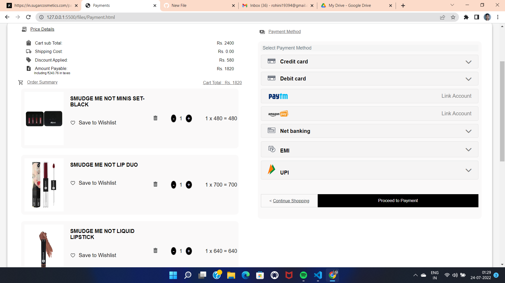

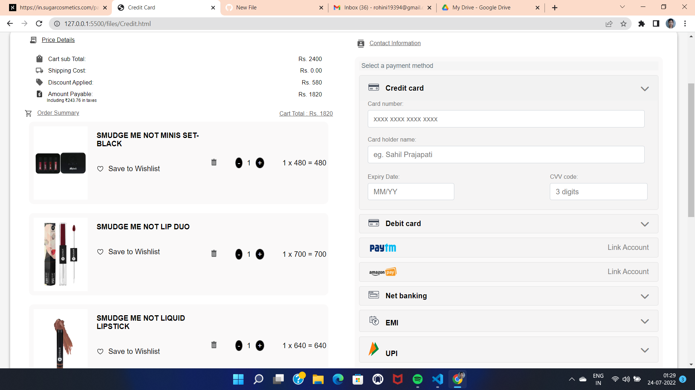

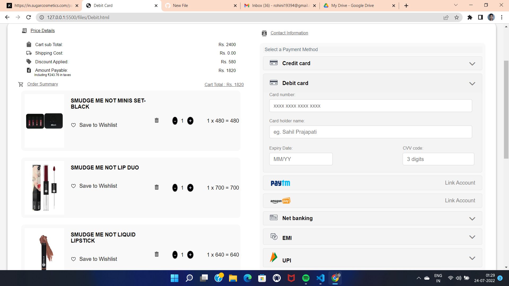

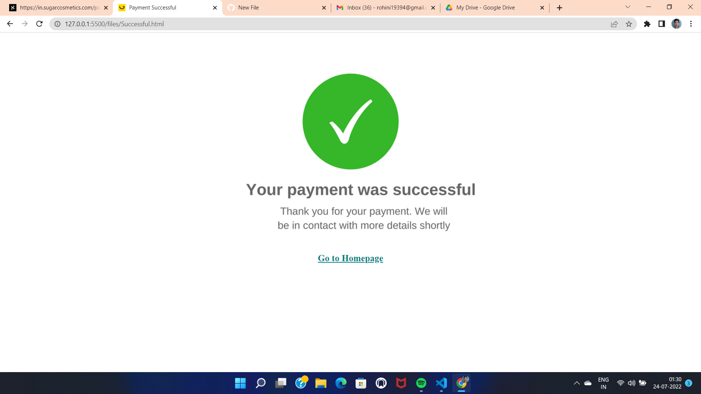

## Footer Page :

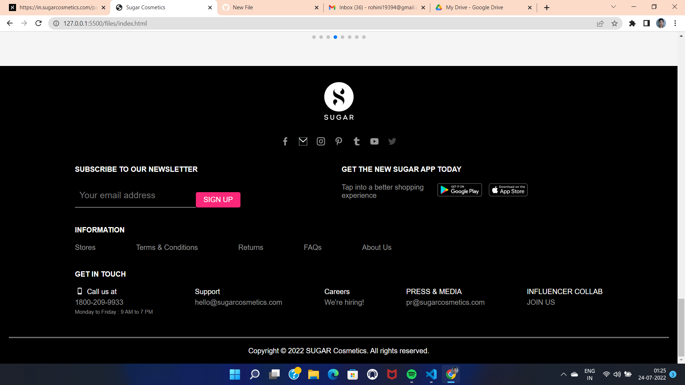

## Learnings :
- Real-life implementation of HTML, CSS along with Advanced Javascript.
- Time-management and Accountability.
- Learn to work in pressure.
- Learn to tackle problems and how to keep our-self motivated.

## Links :
- **Github** : https://github.com/rohiniee0028
- **Email** : rohini19394@gmail.com
- **LinkedIn** : https://www.linkedin.com/in/rohini-kushwaha-735b9322b/

